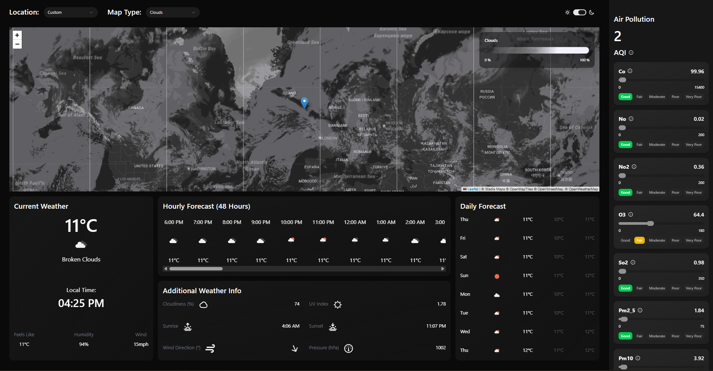

# Weather App

A weather dashboard built with React, TypeScript, and the OpenWeatherMap API. It has an interactive map, live weather data, multi-layer weather overlays, and a detailed air pollution breakdown.

> I built this by following an in-depth tutorial, as a way to learn modern React — TanStack Query, Suspense-based data loading, lifting state up, runtime validation with Zod, and wiring an imperative library (Leaflet) into React with refs. The structure and patterns follow the tutorial; I worked through it to understand how the pieces fit together rather than to ship something original.



## Features

- **Current weather** — temperature, conditions, local time (in the selected location's timezone), feels-like, humidity, and wind
- **Hourly forecast** — 48-hour scrollable forecast
- **Daily forecast** — multi-day outlook with high/low temperatures
- **Interactive map** — click anywhere to get weather for that location, or pick from a list of major cities
- **Weather overlays** — switch the map between clouds, precipitation, pressure, wind, and temperature layers, each with a colour-coded legend
- **Air pollution panel** — AQI rating plus a breakdown of eight pollutants (CO, NO, NO₂, O₃, SO₂, PM2.5, PM10, NH₃), each shown against its quality thresholds
- **Light/dark theme** — toggle between themes
- **Fully responsive** — adapts from mobile single-column through to a multi-column desktop layout
- **Skeleton loaders** — content placeholders while data loads, via React Suspense

## Tech Stack

- **React 19** + **TypeScript**
- **Vite** — build tool and dev server
- **TanStack Query** — data fetching, caching, and Suspense integration
- **Zod** — runtime validation of API responses
- **Tailwind CSS v4** + **shadcn/ui** — styling and accessible components
- **Leaflet** — interactive maps
- **OpenWeatherMap API** — weather, map tiles, and air pollution data

## Getting Started

### Prerequisites
- Node.js (v18 or higher)
- An OpenWeatherMap API key with access to the One Call 3.0 API ([sign up here](https://openweathermap.org/api))

### Installation

1. Clone the repository:
```bash
git clone https://github.com/kyleharperdev/weather-app
cd weather-app
```
2. Install dependencies:
```bash
npm install
```
3. Create a `.env.local` file in the project root and add your API key:
```
VITE_API_KEY=your_openweathermap_api_key_here
```
4. Start the development server:
```bash
npm run dev
```
5. Open the local URL shown in your terminal (usually `http://localhost:5173`).

## Available Scripts

- `npm run dev` — start the development server
- `npm run build` — build for production
- `npm run preview` — preview the production build locally
- `npm run lint` — run ESLint

## Project Structure

```
src/
├── api.ts                    # API fetch functions with Zod validation
├── components/
│   ├── cards/                # Weather data cards
│   ├── dropdowns/            # Location and map-type selectors
│   ├── skeletons/            # Loading placeholders
│   ├── ui/                   # shadcn/ui components
│   ├── Map.tsx               # Leaflet map
│   ├── MapLegend.tsx         # Overlay colour legend
│   └── SidePanel.tsx         # Air pollution panel
├── schemas/                  # Zod schemas for API responses
└── App.tsx                   # Root component and state
```
